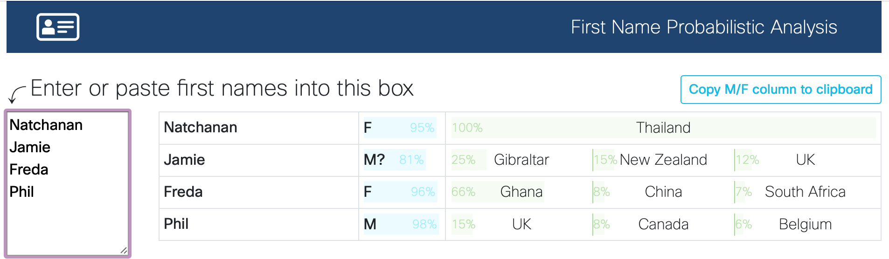

# Guess nationality and gender from first name

This web app presents a basic UI over [genderize.io](https://genderize.io/) and
[nationalize.io](https://nationalize.io/) to guess some information about a
first name.

You can try the app at [https://names.chatts.net](https://names.chatts.net/).

The underlying APIs are far from perfect, but can be helpful. They provide a
guess at both gender, and up to three countries where the name is most popular.
(For very common names, where there may be dozens of countries with similar
popularity, these can be pretty random.) Percentage confidence bars are rendered
for each of these.

Those API services have a free quota of 1000 names per day (seemingly per IP
address).

## Development

For interactive development, use
[nix develop](https://nixos.org/manual/nix/unstable/command-ref/new-cli/nix3-develop.html)
(optionally using [direnv](https://direnv.net)) and then run `trunk serve`.

## Deployment

Run the `deploy` script from a nix shell to deploy to netlify.
